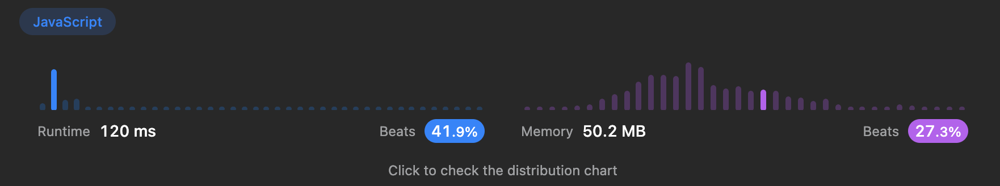

# [알고리즘 문제풀이] 160. Intersection of Two Linked Lists

# **160. Intersection of Two Linked Lists**

링크: [https://leetcode.com/problems/intersection-of-two-linked-lists/description/](https://leetcode.com/problems/intersection-of-two-linked-lists/description/)

### 문제 파악

(어떤 문제인가)

- 두 개의 cycle 이 없는 Linked List 가 주어진다. 이때, 두 linked list가 교차하는 지점이 있다면, 그때의 node 를 반환하라. 없다면, null을 반환하라.
- 추가조건: 시간 복잡도 O(m+n), 공간 복잡도 O(1) 으로 할 수 있겠는가?

## 첫번째 풀이

```jsx
/**
 * Definition for singly-linked list.
 * function ListNode(val) {
 *     this.val = val;
 *     this.next = null;
 * }
 */

/**
 * @param {ListNode} headA
 * @param {ListNode} headB
 * @return {ListNode}
 */
var getIntersectionNode = function(headA, headB) {
    var curA = headA;
    var cntA = 0;
    var curB = headB;
    var cntB = 0;
    while(curA.next) {
        curA = curA.next;
        cntA += 1;
    }
    while (curB.next) {
        curB = curB.next;
        cntB += 1;
    }
    
    if (!(curA === curB)) return null;
    else {
        curA = headA;
        curB = headB;
        for (i=0; i<Math.abs(cntA-cntB); i++) {
            if (cntA >= cntB) curA = curA.next;
            else curB = curB.next;
        }
        while (curA !== curB) {
            curA = curA.next;
            curB = curB.next;
        }
        return curA;
    }
};
```

(설명) 교차 이후로부터는 모든 node 가 같아야 하기 때문에, 우선 끝까지 가서 끝 값이 같은지를 확인한다.

- 만약 끝값이 같다? 그러면 교차점이 있는 것 ⇒ 처음으로 돌아가서, 두 node 길이가 같아지는 지점까지 더 긴 node를 당겨온다.
- 길이가 맞춰진 이후로는 한 칸씩 전진하면서, node가 같은지 확인한다.
- Time Complexity: O(m+n)
- Space Complexity: O(1)

### (실패했다면? 틀린 이유)

(실패한 이유)

### (성공했다면? 결과)

(leetcode에 나온 코드 결과를 적으세요)



(더 나은 풀이가 있을 수 있을지 고민)

- 다소 복잡하게 푼 것 같기도 하고. 꼭 끝까지 가봐야만 알 수 있을까?
    - 길이를 알기 위함이었나..? O(m+n)으로 풀라는 말에, 더 집착해서 그런 것 같기도

## 좋은 풀이

```jsx
var getIntersectionNode = function(headA, headB) {
    var curA = headA;
    var curB = headB;
    while (curA !== curB) {
        curA = curA ? curA.next : headB;
        curB = curB ? curB.next : headA;
    }
    return curA;
};
```

(설명) 두 node 를 합쳐서 A = A + B로, B = B+A 로 만들어서 길이를 통일하는 방법이다. 그렇게 하면, 교차하는 지점은 어차피 동일하니까. 그때 찾으면 된다. **아주 빛나는 풀이!! m+n은 결국, m+n 짜리 길이 Node를 만들라는 뜻!**

- Leetcode에 이런 그림 설명까지 있었다.


- Time Complexity: O(m+n)
- Space Complexity: O(1) 추가 메모리 발생하지 않게, curA가 끝나면 그냥 커서를 curB로 옮겨주기만 했다.

---

### 배운 것들 정리

- node 두 개 합쳐서 나타내기? 문제 해결을 위한 핵심을 다시 살피자.
    - 알아야 하는 본질은 결국, 길이 맞추기 였으므로.. 나처럼 길이 차를 알아내는 것보다 두 개를 더해버려서 통일하는 것이 더 효과적.