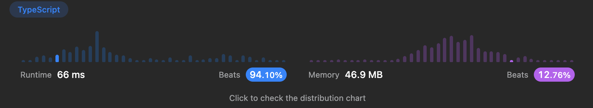

# [알고리즘 문제풀이] 169. Majority Element

# **169. Majority Element**

링크: [https://leetcode.com/problems/majority-element/](https://leetcode.com/problems/majority-element/)

### 문제 파악

(어떤 문제인가)

- 주어진 길이 n인 배열 내 과반을 차지하는 원소를 반환하라
- 추가조건: 시간 복잡도 O(n), 공간 복잡도 O(1) 으로 할 수 있는가?

## 첫번째 풀이

```tsx
function majorityElement(nums: number[]): number {
    nums = nums.sort();
    return nums[Math.floor((nums.length+1)/2)-1];
};
```

(설명) 과반을 차지하는 수라면 sort 이후, 중앙에 있어야 한다. (끝에서부터 채운다해도 가운데를 꼭 지나야 하기 때문)

- Time Complexity: O(nlogn)
- Space Complexity: O(1)

### (실패했다면? 틀린 이유)

(실패한 이유)

### (성공했다면? 결과)

(leetcode에 나온 코드 결과를 적으세요)



(더 나은 풀이가 있을 수 있을지 고민)

시간 복잡도가 O(n) 인 방법은 도무지 떠오르지 않는다..

## 좋은 풀이

```tsx
function majorityElement(nums: number[]): number {
    let candidate;
    let count = 0;
    
    for (const num of nums) {
        if (count === 0) {
            candidate = num;
        }
        
        count += (num === candidate) ? 1 : -1
    }
    
    return candidate;
};
```

(설명) candidate와 다른 수가 나오면 counter—, 같은 수가 나오면 counter++ 하고, counter 가 0일 때마다 candidate을 바꿔준다.

- 핵심은, 과반을 차지하는 수라면, counter 가 어떤 상황에서든 양수가 된다는 것이다. 과반인 수를 m이라 하면,
    - m이 candidate 일 때, count 는 계속 증가. ⇒ 다른 수는 m보다 결국 갯수가 적기 때문에, count가 0이 되어 교체되는 시점 존재
    - m이 아닌 수가 candidate일 때, Count는 언제가 0 이 되어 m으로 교체
- Time Complexity: O(n) for문 하나 돌기 때문에
- Space Complexity: 추가 공간 X

---

### 배운 것들 정리

- 이 알고리즘을 Boyer-Moore majority vote algorithm 이라고 한단다. 재밌는 아이디어를 배웠다!

[Boyer-Moore majority vote algorithm - Wikipedia](https://en.wikipedia.org/wiki/Boyer%E2%80%93Moore_majority_vote_algorithm)