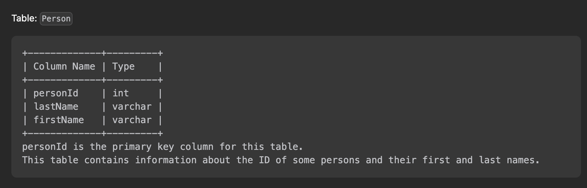

# [알고리즘 문제풀이] 175. Combine Two Tables

# **175. Combine Two Tables**

링크: [https://leetcode.com/problems/combine-two-tables/description/](https://leetcode.com/problems/combine-two-tables/description/)

### 문제 파악

(어떤 문제인가)

- SQL 문제.. 아래와 같은 두 테이블이 있다.




- Person 테이블 내 first name, last name, city, 그리고 state 을 호출하는 SQL query를 짜라. 이때, address 에 없다면, null 을 반환하라.

## 첫번째 풀이

```sql
# Write your MySQL query statement below
select firstName, lastName, city, state from Person left join Address on Person.personId = Address.personId
```

(설명) left Join 해서, person 을 기준으로 address가 있는 것 없는 것 모두 반환하게 했다.

- Time Complexity:
- Space Complexity:

### (성공했다면? 결과)

(leetcode에 나온 코드 결과를 적으세요)

(더 나은 풀이가 있을 수 있을지 고민) 간단한 문제라.. 비슷할 것 같다.

## 좋은 풀이

```sql
# Write your MySQL query statement below
select FirstName, LastName, City, State 
from Person left join Address on Person.PersonId = Address.PersonId;
```

(설명) 동일하다.

---

### 배운 것들 정리

- 오랜만에 mySQL join 복습..?