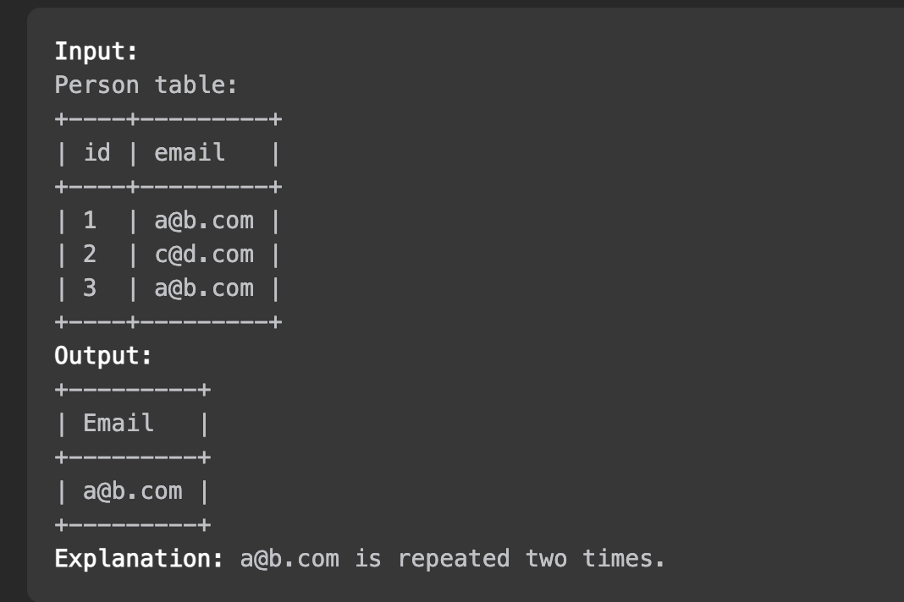

# [알고리즘 문제풀이] 182. Duplicate Emails

# **182. Duplicate Emails**

링크: [https://leetcode.com/problems/duplicate-emails/description/](https://leetcode.com/problems/duplicate-emails/description/)

### 문제 파악

(어떤 문제인가)

- SQL. ID 와 email이 주어진 테이블에서, 중복된 이메일을 찾아서 노출하라.



## 첫번째 풀이

```sql
# Write your MySQL query statement below
select A.email as Email
from Person as A
inner join Person as B
on (A.email = B.email)
where A.id != B.id and A.id < B.id
```

(설명) self join 시키고, ID가 겹치니, A 가 더 작을 때만 반환하게 했다.

- Time Complexity:
- Space Complexity:

### (실패했다면? 틀린 이유)

(실패한 이유) {"headers": {"Person": ["id", "email"]}, "rows": {"Person": [[1, "[jacky@yahoo.com](mailto:jacky@yahoo.com)"], [2, "[jacky@yahoo.com](mailto:jacky@yahoo.com)"], [3, "[jacky@yahoo.com](mailto:jacky@yahoo.com)"]]}} 에 대해, 1<2, 1<3, 2<3 이라 총 3번 반환했다.

### (성공했다면? 결과)

(leetcode에 나온 코드 결과를 적으세요)

(더 나은 풀이가 있을 수 있을지 고민)

## 두번째 풀이

```jsx
# Write your MySQL query statement below
select distinct A.email as Email
from Person as A
inner join Person as B
on (A.email = B.email)
where A.id != B.id
```

(설명) distinct keyword 추가

- Time Complexity:
- Space Complexity:

### (실패했다면? 틀린 이유)

(실패한 이유)

### (성공했다면? 결과)

(leetcode에 나온 코드 결과를 적으세요)

(더 나은 풀이가 있을 수 있을지 고민) join이 들어가면, 불필요한 연산이 아무래도 많아지게 된다.

## 좋은 풀이

```sql
select Email
from Person
group by Email
having count(Email) > 1;
```

(설명) Email 로 묶고, group 의 email 수가 1개 이상인 group들을 반환하는 것이다.

- Time Complexity:
- Space Complexity:

---

### 배운 것들 정리

- Group by, having 내용 복습