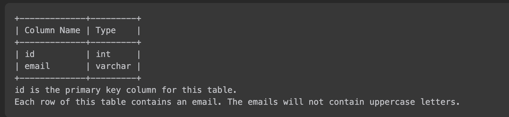

# [알고리즘 문제풀이] 196. Delete Duplicate Emails

# **196. Delete Duplicate Emails**

링크: [https://leetcode.com/problems/delete-duplicate-emails/description/](https://leetcode.com/problems/delete-duplicate-emails/description/)

### 문제 파악

(어떤 문제인가)

- SQL 문제. Person 테이블이 아래와 같이 주어질 때, email 이 겹치는 행을 지워라.



- 가장 ID가 작은 행만을 남겨놓을 것


## 첫번째 풀이

```sql
delete
from Person 
where Person.id in (select distinct A.id from Person A 
inner join Person B
on A.email = B.email)
```

(설명) Person 에서 ID 가 subquery 에 있는 것을 삭제하려 했다. 근데.. Person 자체를 update 하려고 하니 에러 발생

- Time Complexity:
- Space Complexity:

### (실패했다면? 틀린 이유)

(실패한 이유) MySQL의 특징으로 데이터를 추가나 갱신할 경우 **동일한 테이블로 서브쿼리를 사용할 수 없도록** 되어 있기 때문이다.

### (성공했다면? 결과)

(leetcode에 나온 코드 결과를 적으세요)

(더 나은 풀이가 있을 수 있을지 고민)

## 좋은 풀이 (답지 참고)

```sql
DELETE p1 FROM Person p1,
    Person p2
WHERE
    p1.Email = p2.Email AND p1.Id > p2.Id
```

(설명) Person 을 alias로 두고, where로만 삭제.

---

### 배운 것들 정리

- SQL 용법 (update 관련 내용 복습)