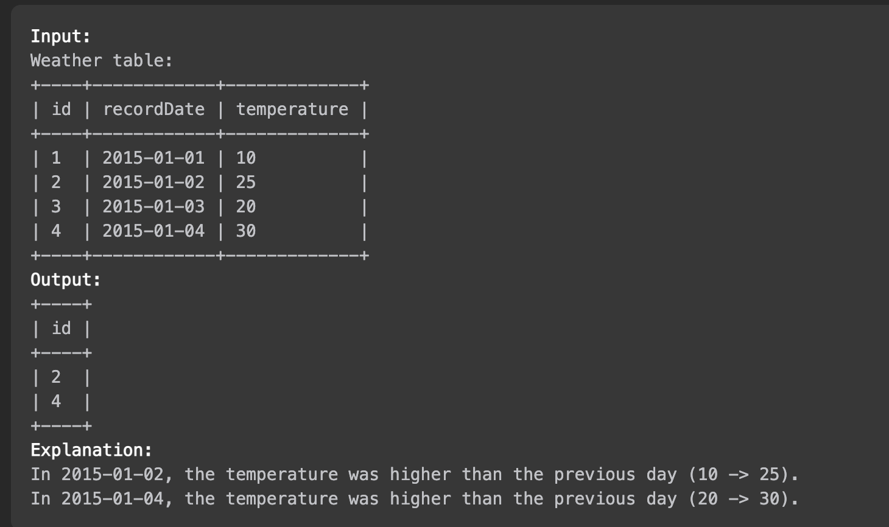

# [알고리즘 문제풀이] 197. Rising Temperature

# 197. Rising Temperature

링크: [https://leetcode.com/problems/rising-temperature/description/](https://leetcode.com/problems/rising-temperature/description/)

### 문제 파악

(어떤 문제인가)

- Weather 테이블이 아래와 같이 나와있다. 이때 어제보다 오늘 더 기온이 오른 날들을 골라라



-

## 첫번째 풀이

```sql
# Write your MySQL query statement below

select W2.id
from Weather W1, Weather W2
where DATE(DATE_ADD(W1.recordDate, interval 1 day)) = W2.recordDate 
and W1.temperature < W2.temperature
```

(설명) DATE_ADD를 적용해서 하루 차이 나는 날들을 찾고, 그 중에서 기온도 더 높은 날을 골라준다.

### (성공했다면? 결과)

(leetcode에 나온 코드 결과를 적으세요)

(더 나은 풀이가 있을 수 있을지 고민) join 없이 where 만으로 하는 풀이가 맞는건가..? 정확하게 그 행을 골라내는지가 의문…

## 좋은 풀이 (답지)

```sql
SELECT
    weather.id AS 'Id'
FROM
    weather
        JOIN
    weather w ON DATEDIFF(weather.recordDate, w.recordDate) = 1
        AND weather.Temperature > w.Temperature
;
```

(설명) 비슷하게 DateDIFF 를 이용. 공식 풀이에서는 join을 이용, 그러나 다른 풀이들을 참고해보니 join을 하지 않아도 되는 것 같다.

- Time Complexity:
- Space Complexity:

---

### 배운 것들 정리

- DATE_ADD, DATEDIFF 활용법, 같은 테이블을 2개로 만들어서 테이블 내 비교하는 방법 이해