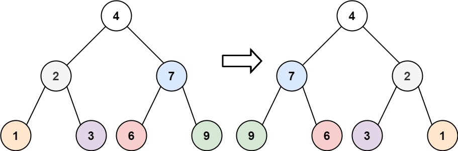

# [알고리즘 문제풀이] 226. Invert Binary Tree

# **226. Invert Binary Tree**

링크: [https://leetcode.com/problems/invert-binary-tree/](https://leetcode.com/problems/invert-binary-tree/)

### 문제 파악

(어떤 문제인가) 주어진 binary Tree의 역을 구하라. 모든 child의 좌우를 반전하라.



## 첫번째 풀이

```tsx
/**
 * Definition for a binary tree node.
 * class TreeNode {
 *     val: number
 *     left: TreeNode | null
 *     right: TreeNode | null
 *     constructor(val?: number, left?: TreeNode | null, right?: TreeNode | null) {
 *         this.val = (val===undefined ? 0 : val)
 *         this.left = (left===undefined ? null : left)
 *         this.right = (right===undefined ? null : right)
 *     }
 * }
 */

function invertTree(root: TreeNode | null): TreeNode | null {
    if (!root) return null;
    if (!root.left && !root.right) return root;
    if (root.left || root.right) {
        var l = root.left;
        var r = root.right;
        root.left = invertTree(r);
        root.right = invertTree(l);
    }
    return root;
};
```

(설명) 재귀를 이용하여 간단히 해결. base case는 child 가 없을 때는 root 그 자체를 반환. 있을 때는, 각각의 invertTree 를 적용한 값을 좌우 반전하여 적용

- Time Complexity: O(n) ⇒ 모든 노드마다 한 번씩 실행하므로
- Space Complexity: O(h) ⇒ 깊이마다 콜 스택 생성.

### (실패했다면? 틀린 이유)

(실패한 이유)

### (성공했다면? 결과)

(leetcode에 나온 코드 결과를 적으세요)

(더 나은 풀이가 있을 수 있을지 고민)

## 좋은 풀이

```jsx
function invertTree(root: TreeNode | null): TreeNode | null {
  if (!root) return null;
  
  const queue: TreeNode[] = [root];
  
  while (queue.length > 0) {
    const curr = queue.shift()!;
    
    // swap left and right child
    const temp = curr.left;
    curr.left = curr.right;
    curr.right = temp;
    
    if (curr.left) queue.push(curr.left);
    if (curr.right) queue.push(curr.right);
  }
  
  return root;
}
```

(설명) 이 풀이는 Iterative Solution을 이용. BFS 로 돌면서, 각 노드가 자신의 바로 아래 자식만 바꿔가면서 넣고, 그 아래 child에 대해서는 while 문을 돌면서 해결

- Time Complexity: O(n)
- Space Complexity: O(n)

---

### 배운 것들 정리

- 재귀 ⇒ DFS 에 이은 iterative & queue ⇒ BFS 방법 이해