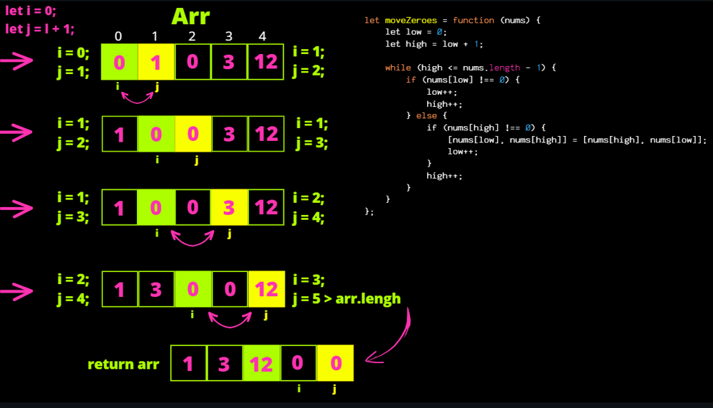

# [알고리즘 문제풀이] **283. Move Zeroes**

# **283. Move Zeroes**

링크: [https://leetcode.com/problems/move-zeroes/description/](https://leetcode.com/problems/move-zeroes/description/)

### 문제 파악

(어떤 문제인가) nums 배열이 주어질 때, 0이 아닌 숫자들의 상대적 위치는 유지하면서 0들은 전부 베열의 오른쪽으로 이동하라. (복사본을 만들지 않고 in-place로 할 것)

- 추가요건) 최소한의 실행만으로 가능한가?
-

## 첫번째 풀이

```tsx
/**
 Do not return anything, modify nums in-place instead.
 */
function moveZeroes(nums: number[]): void {
    let curr = 0;
    let total = 0;
    while (total < nums.length) {
        if (nums[curr] === 0) {
            nums.splice(curr, 1);
            nums.push(0);
        }
        else {
            curr++;
        }
        total++;
    }
};
```

(설명) 방법이 생각나지 않아서.. 가장 기초적인 방법 활용.. O(n)의 iteration

- Time Complexity: O(n)
- Space Complexity:

### (실패했다면? 틀린 이유)

(실패한 이유)

### (성공했다면? 결과)

(leetcode에 나온 코드 결과를 적으세요)

(더 나은 풀이가 있을 수 있을지 고민) 내 방법은 0이 아닌 원소들까지도 결국은 확인한다는 것이 문제..

## 두번째 풀이

```jsx

```

(설명)

- Time Complexity:
- Space Complexity:

### (실패했다면? 틀린 이유)

(실패한 이유)

### (성공했다면? 결과)

(leetcode에 나온 코드 결과를 적으세요)

(더 나은 풀이가 있을 수 있을지 고민)

## 세번째 풀이

```jsx

```

(설명)

- Time Complexity:
- Space Complexity:

### (실패했다면? 틀린 이유)

(실패한 이유)

### (성공했다면? 결과)

(leetcode에 나온 코드 결과를 적으세요)

(더 나은 풀이가 있을 수 있을지 고민)

## 좋은 풀이



```jsx
function moveZeroes(nums) {
    let low = 0;
    let high = low + 1;

    while (high <= nums.length - 1) {
        if (nums[low] !== 0) {
            low++;
            high++;
        } else {
            if (nums[high] !== 0) {
                [nums[low], nums[high]] = [nums[high], nums[low]];
                low++;
            }
            high++;
        }
    }
};
```

(설명) two-pointer 방법을 활용하여 해결. low가 0이고 high가 0이 아니면, 교체를. low high 둘 다 0이면 high 만 벌려줘서 다음 0이 아닌 수를 찾아준다.

- Time Complexity: O(n) 이라는 점에서는 같지만, 실제적인 swap 자체는 적게 일어날 수 있다.
    - 예를 들어, 많은 0이 이미 끝쪽에 붙어있을 경우.
- Space Complexity:

---

### 배운 것들 정리

- two-pointer