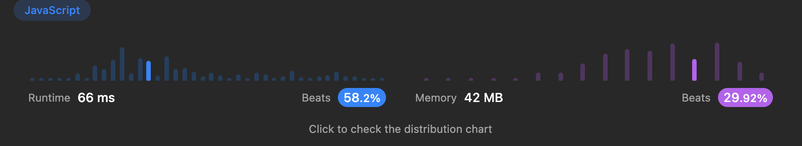

# [알고리즘 문제풀이] 168. Excel Sheet Column Title

# **168. Excel Sheet Column Title**

링크: [https://leetcode.com/problems/excel-sheet-column-title/description/](https://leetcode.com/problems/excel-sheet-column-title/description/)

### 문제 파악

(어떤 문제인가)

- 주어진 숫자를 엑셀에서의 행 ID string으로 반환하라.
    - 예시) A → 1, B→ 1 … Z→ 26, AA → 27

## 첫번째 풀이

```jsx
/**
 * @param {number} columnNumber
 * @return {string}
 */
var convertToTitle = function(columnNumber) {
    var res = "";
    var q = Math.floor(columnNumber / 26);
    var r = columnNumber % 26;
    const alpha = Array.from(Array(26)).map((e, i) => i + 65);
    const alphabet = alpha.map((x) => String.fromCharCode(x));
    res = alphabet[r-1] + res
    while (q > 0) {
        r = q % 26;
        q = Math.floor(q / 26);
        if (r === 0) {
            q = q-1;
            res = alphabet[25] + res;
        }
        else res = alphabet[r-1] + res
    }
    
    return res;
};
```

(설명) 진법의 아이디어 적용

- Time Complexity: O(logn) n 은 주어진 columnNumber. log 값 만큼 자릿수가 정해지기 때문
- Space Complexity:

### (실패했다면? 틀린 이유)

(실패한 이유) Input: 26 expected: Z, output: “A undefined”

- 진법과 아주 일치하지는 않고, 딱 맞게 끝났을 때는 자리올림이 아닌 Z로 끝나야 하는 것을 고려 X

### (성공했다면? 결과)

(leetcode에 나온 코드 결과를 적으세요)

(더 나은 풀이가 있을 수 있을지 고민)

## 두번째 풀이

```jsx
/**
 * @param {number} columnNumber
 * @return {string}
 */
var convertToTitle = function(columnNumber) {
    var res = "";
    var q = Math.floor(columnNumber / 26);
    var r = columnNumber % 26;
    const alpha = Array.from(Array(26)).map((e, i) => i + 65);
    const alphabet = alpha.map((x) => String.fromCharCode(x));
    if (r === 0) {
            q = q-1;
            res = alphabet[25] + res;
        }
    else res = alphabet[r-1] + res;
    while (q > 0) {
        r = q % 26;
        q = Math.floor(q / 26);
        if (r === 0) {
            q = q-1;
            res = alphabet[25] + res;
        }
        else res = alphabet[r-1] + res
    }
    
    return res;
};
```

(설명) 나머지가 0일때, 자리올림 하는 것이 아니라, q= q-1 처리하는 것이 핵심

- Time Complexity: O(logn)
- Space Complexity: O(1)

### (실패했다면? 틀린 이유)

(실패한 이유)

### (성공했다면? 결과)

(leetcode에 나온 코드 결과를 적으세요)



(더 나은 풀이가 있을 수 있을지 고민)

굳이 alphabet 배열을 만들지 않고, 그때 그때 string.charCode를 그냥 호출해도 된다.

## 좋은 풀이

```jsx
var convertToTitle = function(n) {
    if (n == 0) return null;
    let result = '';
    while (n > 0) {
        let r = n % 26;
        let d = parseInt(n / 26);
        if (r == 0) {
            r = 26;
            d = d - 1;
        }
        result = String.fromCharCode (64 + r)+result;
        n = d;
    }
    return result;
};
```

(설명) 동일한 원리. 핵심은 r === 0 일때, d = d-1 시키는 것

- Time Complexity: O(logn)
- Space Complexity: O(1)

---

### 배운 것들 정리

- 진법 관련 문제 풀이. 몫이 0이상일때까지 while 문 돌기
- 알파벳의 배열을 만드는 방법! 자주 쓰일 것 같다.

```jsx
    const alpha = Array.from(Array(26)).map((e, i) => i + 65);
    const alphabet = alpha.map((x) => String.fromCharCode(x));
```