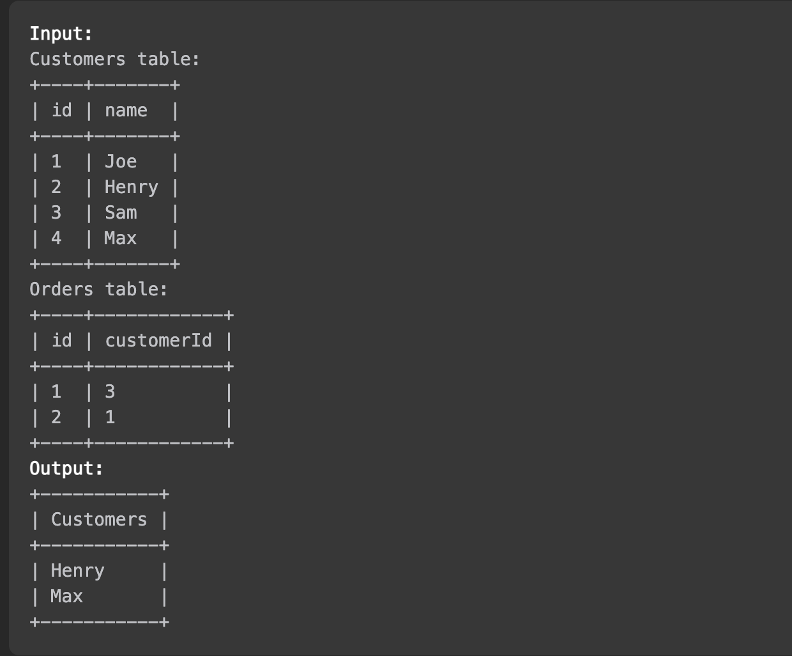

# [알고리즘 문제풀이] 183. Customers Who Never Order

# **183. Customers Who Never Order**

링크: [https://leetcode.com/problems/customers-who-never-order/description/](https://leetcode.com/problems/customers-who-never-order/description/)

### 문제 파악

(어떤 문제인가)

- SQL. Customers 와 Orders가 아래와 같이 주어질 때, 주문을 하지 않은 손님들의 이름을 반환하라



## 첫번째 풀이

```sql
# Write your MySQL query statement below
select name as Customers
from Customers
where name not in (select name
from Customers inner join Orders
on customers.id = orders.customerid)
```

(설명) customer.ID 와 order.customerID 가 같은 열을 기준으로 묶고, 거기에 없는 name을 골라라.

- Time Complexity:
- Space Complexity:

### (실패했다면? 틀린 이유)

(실패한 이유) {"headers": {"Customers": ["id", "name"], "Orders": ["id", "customerId"]}, "rows": {"Customers": [[1, "James"], [2, "James"]], "Orders": [[1, 1]]}}

ID는 다르지만, 이름은 같은 경우를 미포함했다.

### (성공했다면? 결과)

(leetcode에 나온 코드 결과를 적으세요)

(더 나은 풀이가 있을 수 있을지 고민)

## 두번째 풀이

```sql
# Write your MySQL query statement below

select name as Customers
from Customers
where customers.id not in (select customers.id
from Customers inner join Orders
on customers.id = orders.customerid)
```

(설명) id 를 기준으로 검색해서, 해당 Join 에 없는 행들만 고른 후, 거기서 name을 찾았다.

- Time Complexity:
- Space Complexity:

### (실패했다면? 틀린 이유)

(실패한 이유)

### (성공했다면? 결과)

(leetcode에 나온 코드 결과를 적으세요)

(더 나은 풀이가 있을 수 있을지 고민) inner join 을 넣어서 시간이 느렸다.

## 좋은 풀이

```sql
select customers.name as 'Customers'
from customers
where customers.id not in
(
    select customerid from orders
);
```

(설명) 굳이 join을 하지 않고도 찾을 수 있었다..!

- Time Complexity:
- Space Complexity:

---

### 배운 것들 정리

- not in
    - 해당 column name 이 정해진 values 혹은 subquery 에 있는지 확인
- not exists
    - 는 해당 subquery에 해당하는 값이 있으면 true를 반환

