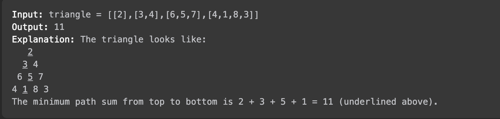

# [알고리즘 문제풀이] 120. Triangle

# **120. Triangle**

링크: [https://leetcode.com/problems/triangle/description/](https://leetcode.com/problems/triangle/description/)

### 문제 파악

(어떤 문제인가)

- 주어진 2d array 는 삼각형을 나타낸다. 이때, 꼭대기에서 바닥까지 합이 가장 작은 경로의 합을 반환하라.
- 추가 조건: 공간 복잡도 O(n) 만 이용하는 방법을 생각할 수 있는가?



## 첫번째 풀이

```jsx
/**
 * @param {number[][]} triangle
 * @return {number}
 */
var minimumTotal = function(triangle) {
    if (triangle.length === 1) {
        return triangle[0][0];
    }
    else {
        var length = triangle.length;
        var top = triangle.shift();
        var modifyTriangle1 = triangle.map((item) => item.slice(0, -1));
        var modifyTriangle2 = triangle.map((item) => item.slice(1));
        return top[0] + Math.min(minimumTotal(modifyTriangle1), minimumTotal(modifyTriangle2))
    }
};
```

(설명) 또 다시 재귀..  그러나, Time Exceeded Error 발생

- Time Complexity:  O(2^n) 각 함수마다 2개씩의 recursion 함수를 자식으로 생성하기에.. 2^n 만큼 실행
- Space Complexity: O(n^2).. triangle 복사본을 의미없이 생산한다.

### (실패했다면? 틀린 이유)

 (실패한 이유) Time Exceeded. ⇒ 재귀는 효과적이지 않은 방법. DP 를 고려.

### (성공했다면? 결과)

(leetcode에 나온 코드 결과를 적으세요)

(더 나은 풀이가 있을 수 있을지 고민)

## 두번째 풀이

```jsx
/**
 * @param {number[][]} triangle
 * @return {number}
 */
var minimumTotal = function(triangle) {
    var item = triangle;
    for (i=1; i<triangle.length; i++) {
        item[i][0] += item[i-1][0];
        for (j=1; j<triangle[i].length; j++) {
            if (j === triangle[i].length-1) {
                item[i][j] += item[i-1][j-1];
            }
            else {
                item[i][j] += Math.min(item[i-1][j], item[i-1][j-1]);
            }
        }
    }
    console.log(item);
    return Math.min(...item[item.length-1]);
};
```

(설명) for 문을 두 개 돌면서, 문제 정의대로 최소 경로를 찾는 방법. 그때 item의 값은 각각 위에서부터 값을 더하면서 내려온다.

- Time Complexity: O(n^2) ⇒ n-1 * n-1 이므로.
- Space Complexity: O(n^2) ⇒ item은 결국 triangle 의 복사본이기 때문에.

### (실패했다면? 틀린 이유)

 (실패한 이유) 

### (성공했다면? 결과)

(leetcode에 나온 코드 결과를 적으세요)


(더 나은 풀이가 있을 수 있을지 고민)

- item을 굳이 triangle을 복사해야 하나? 그냥 triangle 자체를 써도 된다

## 세번째 풀이

```jsx
/**
 * @param {number[][]} triangle
 * @return {number}
 */
var minimumTotal = function(triangle) {
    var item = [];
    item.push(triangle[0][0]);
    for (i=1; i<triangle.length; i++) {
        triangle[i][0] += triangle[i-1][0];
        for (j=1; j<triangle[i].length; j++) {
            if (j === triangle[i].length-1) {
                triangle[i][j] += triangle[i-1][j-1];
            }
            else {
                triangle[i][j] += Math.min(triangle[i-1][j], triangle[i-1][j-1]);
            }
        }
        item.push(Math.min(...triangle[i]));
    }
    return item.pop();
};
```

(설명) 두번째 풀이에서 item의 정의만 다르게 해서, 각 행의 최솟값만 item에 포함. 그러나, 막상 item을 쓰지는 않음.

- Time Complexity: O(n^2)
- Space Complexity: O(n)

### (실패했다면? 틀린 이유)

 (실패한 이유)

### (성공했다면? 결과)

(leetcode에 나온 코드 결과를 적으세요)


(더 나은 풀이가 있을 수 있을지 고민)

## 좋은 풀이

```jsx
/**
 * @param {number[][]} triangle
 * @return {number}
 */
var minimumTotal = function(triangle) {
    for(let i = triangle.length - 2; i >= 0; i--){
        for(let j = 0; j < triangle[i].length; j++){
            triangle[i][j] += Math.min(triangle[i+1][j], triangle[i+1][j+1]);
        }
    }
    return triangle[0][0];
}
```

(설명) bottom → top 방식의 풀이. 원리는 동일. trinagle을 추가로 사용하지 않음

- Time Complexity: O(n^2)
- Space Complexity: O(1) 추가 메모리 X

### 함수형 프로그래밍 예시

```jsx
/**
 * @param {number[][]} triangle
 * @return {number}
 */
const minimumTotal = triangle =>
    triangle.reduceRight((prev, curr) =>
        curr.map((val, i) => val + Math.min(prev[i], prev[i + 1]))
    )[0];
```

- 오른쪽에서부터 reduce 해오면서 갱신, curr (윗행) 은 각 원소에 더한 그 행 자체를 map 해서 반환

---

### 배운 것들 정리

- Dynamic Programming
    - 재귀보다 효과적인 방법이 많을 때도 있다.
    - in-place modification 은 추가 메모리를 반환하지 않는다.
    - 기존 값이 유지될 필요가 없다면? 의미있는 값을 넣어서 이용하자.